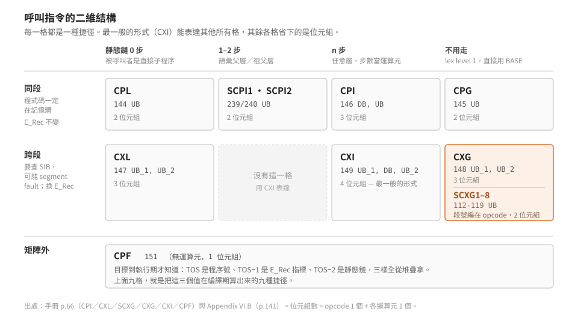

# 程序呼叫怎麼進行

p-machine 光是「呼叫一個程序」就有九族助記符、十七個 opcode 值。

> 延伸閱讀：[p-machine 是什麼](what-is-a-p-machine.md)｜
> [記憶體佈局、Task 環境與活動記錄](../50-iv-internals/memory-and-activation.md)｜
> [IV 版指令逐條語意](../50-iv-internals/instruction-set-details.md)

結論先講：這九族不是設計者列舉出來的，是**兩個獨立問題各自的答案相乘**。
呼叫一次要解決的是「被呼叫者的變數在哪」與「被呼叫者的程式碼在哪」，
兩個問題各自都有便宜的常見情形與昂貴的一般情形，把常見情形編成獨立的 opcode，
矩陣就長出來了。認出這個結構，這堆助記符就不用背。

## 一次呼叫要留下什麼

被呼叫者跑完要回得來，所以呼叫的那一刻必須把「回去需要的東西」存起來。
存哪些？從「回來之後要能繼續執行」倒推，缺一不可的有這些：

- **回到哪一行**——呼叫點的位置。
- **回到誰的框**——呼叫者的活動記錄在哪，否則區域變數找不到。
- **被呼叫者的非區域變數在哪**——它要讀寫外層的變數，得有個起點。

前兩項是「回程」需要的，第三項是「去程」需要的。這三件事就是
[活動記錄](../50-iv-internals/memory-and-activation.md#活動記錄figure-5手冊-ii4213p4850)
最低位址那幾個 word 的來由。

## 第一個問題：非區域變數在哪

Pascal 的程序可以巢狀宣告，內層看得到外層的變數。所以被呼叫者需要一個指標，
指向「它語法上的外層」那一個活動記錄——這就是**靜態鏈**（`MSSTAT`）。

關鍵在於：**靜態鏈不能由被呼叫者自己算**。同一個程序可能被不同深度的地方呼叫，
被呼叫者只知道自己寫在哪裡，不知道呼叫者站在哪一層。
所以靜態鏈必須由**呼叫端**填——呼叫端知道自己在哪一層，也知道要呼叫的是誰。

呼叫端怎麼算？從自己的框沿著 `MSSTAT` 往外走幾步就到了。走幾步取決於兩者的相對層數：

| 指令 | 被呼叫者的位置 | 靜態鏈怎麼來 | 沿鏈走幾步 |
|---|---|---|---|
| `CPL` | 呼叫者的直接子程序 | 就是呼叫者自己的框（舊 `MP`） | 0 |
| `SCPI1` | 與呼叫者同層 | 呼叫者的語彙父層 | 1 |
| `SCPI2` | 比呼叫者低一層 | 語彙祖父層 | 2 |
| `CPI DB` | 比呼叫者低 `DB` 層 | 走 `DB` 步，取那個框的靜態鏈 | `DB`+1 |
| `CPG` | lex level 1 | `BASE`，段最外層那個框 | 不用走 |

（`CPL`、`CPI`、`CPG` 出自手冊 p.66；`SCPI1`／`SCPI2` 的語意見
[逐條語意](../50-iv-internals/instruction-set-details.md)。`SCPI1` 等於 `CPI 0`、
`SCPI2` 等於 `CPI 1`。）

`CPI` 一個指令就能表達全部情形——`CPL` 是它的邊界情形，`CPG` 也可以寫成走到底。
那為什麼還要另外三個？

因為 `CPI` 要帶一個位元組說明走幾步，而**真實程式裡走的步數幾乎都是那幾個特定值**：
呼叫自己內部的輔助程序（0 步）、呼叫隔壁的兄弟程序（1 步）、
呼叫最外層的公用程序（直達）。把這幾個常見情形各給一個 opcode，
呼叫點就省下那個位元組。這與[短形式 opcode](../20-pcode-encoding/instruction-encoding.md)
是同一條原則的另一次套用：**用 opcode 的編碼空間換掉高頻出現的運算元位元組**。

`CPG` 值得多看一眼：它不是「走很多步」，是**完全不用走**。lex level 1 的程序，
其外層固定就是本段的最外層區塊，那個框的位址一直放在 `BASE` 裡。
最常見的情形反而最不花時間——這不是巧合，是因為編碼與實作是同一批人一起設計的。

## 第二個問題：程式碼在哪

同一段裡的呼叫，程式碼一定在記憶體——因為此刻正在執行的就是這一段。
跨段就不一定了。IV.0 的 segment 平常放在 **Codepool**，
而 Codepool 是會動的：Heap 或 Stack 要空間時，管理常式會**把整個 Codepool 搬位置**，
不夠再把 segment 換出去（手冊 p.118）。

所以跨段呼叫要多做三件事：

1. 查目標 segment 的 **SIB**，確認它在不在記憶體。不在就發 segment fault，
   等作業系統把它讀進來。
2. 換 **E_Rec**——被呼叫者的全域變數在它自己那一段的全域資料區，不是呼叫者那段的。
3. 回來的時候要把 E_Rec 換回去，而且**呼叫者那一段也可能在這段期間被換出去**。

這三件事在同段呼叫裡一件都不必做。把它們塞進同一個 opcode、每次呼叫都判斷一次，
是拿最頻繁的情形去付最罕見情形的代價。所以 IV.0 直接分成兩組指令：
`CP*` 是同段，`CX*` 是跨段。

第 3 點還有一個容易忽略的後果：**回返點不能存絕對位址**。
Codepool 一搬，呼叫者那段的程式碼就換了位置。所以 Mark Stack 存的是
`MSIPC`——**段內相對的 byte pointer**——再加上 `MSPROC`，呼叫者的程序編號。
「哪一段的第幾號程序、段內第幾個位元組」這組座標不隨搬移而失效，絕對位址會。

還有一個設計上的必然：直譯器偵測到 fault 時會切到 Faulthandler，
處理完之後**造成 fault 的那一條指令會被重新執行**（手冊 p.120）。
這要求呼叫指令在確認目標段就位之前，不能先改動任何狀態——否則重跑一次就錯了。
手冊另外註明，若 Stack fault 是跨段呼叫引起的，Faulthandler 必須把呼叫方與被呼叫方
**兩個** segment 都鎖在記憶體（手冊 p.121）；只鎖一個，另一個會在半途被換走。

## 兩個問題相乘

把兩條軸交叉，就是 IV.0 的呼叫指令表：

矩陣讀出來的三件事：

- **同段那一列比跨段短一個位元組**，因為不必帶 segment 號。
- **每一格省下的是位元組，不是功能。** 最一般的形式（`CXI`，4 個位元組）
  能表達其他所有格的情形；其餘各格都是它的特例。
- **`SCXG` 那一格是唯一被壓成短形式的呼叫**：段號直接編進 opcode 值。
  為什麼是這一格？因為 unit 匯出的都是最外層（lex level 1）的程序，
  所以「跨段 + global」是跨段呼叫裡壓倒性常見的一種。
  一個把程式切成很多段的系統，這一格的頻率高到值得吃掉八個 opcode 值。

`CPF`（Call Formal Procedure）是矩陣外的一格：呼叫「當成參數傳進來的程序」。
目標到執行期才知道，所以三樣東西全部從堆疊拿——TOS 是程序號、TOS−1 是 E_Rec 指標、
TOS−2 是靜態鏈（手冊 p.66）。它反過來說明了前面九格在做什麼：
**那九格是把這三個值在編譯期就算出來的九種捷徑。**

## 於是 Mark Stack 剛好是五個 word

回頭看活動記錄最底下那五個欄位，現在每一個都有來由，一個也不多：

| 欄位 | 為什麼非有不可 |
|---|---|
| `MSSTAT` | 被呼叫者要找非區域變數。由呼叫端算，因為只有呼叫端知道相對層數 |
| `MSDYN` | 回去要接回呼叫者的框。與 `MSSTAT` 指向不同的框，所以不能合併 |
| `MSIPC` | 回到呼叫點。段內相對，因為 Codepool 會搬 |
| `MSENV` | 回到呼叫者那一段的環境。跨段呼叫存在，這個欄位就必須存在 |
| `MSPROC` | 呼叫者的程序編號。與 `MSIPC` 合起來才是一個搬移後仍有效的座標 |

`MSSTAT` 與 `MSDYN` 為什麼不能合併，見
[活動記錄那張圖](../50-iv-internals/memory-and-activation.md)的右半。

## 返回：`RPU`

`RPU`（150，`B` 運算元）把上面每一件事反著做一次：從 Mark Stack 回復呼叫者的狀態、
丟棄 Mark Stack、再從堆疊削掉 `B` 個 word，留下函數回傳值（手冊 p.67）。
若 Mark Stack 裡的 E_Rec 與目前的不同——也就是這是一次跨段返回——必要時發 segment fault，
因為呼叫者那一段可能已經不在記憶體了。

`B` 是要削掉的參數 word 數。**參數由被呼叫者清掉，不是呼叫者**。
理由與前面同一條：一個程序通常有很多個呼叫點，卻只有一個返回點。
把「削幾個 word」寫在 `RPU` 一處，省的是每個呼叫點的位元組。

## 實作對照：SunDog 的 `SCXG` 快速路徑

[解 SunDog 那份直譯器](../30-opcode-tables/sundog-ivx-table.md#一個會讓語意讀錯的陷阱)時，
`SCXG` 的處理常式差點被讀錯：它開頭有一條只在 `d0 == 1`（也就是 opcode `0x70`、`SCXG1`）
才走的快速路徑，去查一張本地表；當時只知道「不能拿快速路徑代表整群」，不知道它為什麼存在。

手冊 p.66 寫明了：

> SCXG1 may refer to a procedure embedded in the Interpreter.
> If this is the case, an Interpreter table contains the procedure's location.

**segment 1 的程序可以直接內嵌在直譯器裡**，此時位置由直譯器自己的表格給出。
那張「本地表」就是手冊說的 Interpreter table。`CXG` 的說明也有同一句
（segment 號為 1 時）。所以那條快速路徑不是最佳化，是規格的一部分——
用來讓最常用的系統程序省掉整趟 p-code 呼叫。

先讀到程式碼、後讀到規格，順序反過來就會把「規格要求的分支」當成「作者的小聰明」。
[柵欄原則](../40-re-workflow/recover-opcode-table.md)在逆向裡的具體樣子就是這個。

## 邊界

- 靜態鏈的步數表是從手冊 p.66 的文字推的；`SCPI1` ≡ `CPI 0`、`SCPI2` ≡ `CPI 1`
  這組對應沒有在手冊裡明寫，是由兩邊的敘述對出來的。
- `CPG` 的 `BASE` 與 TIB 暫存器欄位裡的 `BP`（手冊 p.41）是不是同一個東西，
  手冊沒有寫等式。兩者都描述「最外層那個框」，視為同一個是強推論。
- 本篇沒有追 SunDog 的 `CPL`／`CPI`／`CXI` 處理常式實際碼。
  已對過的只有 `SCXG`（`0x70`–`0x77`）那一族。
