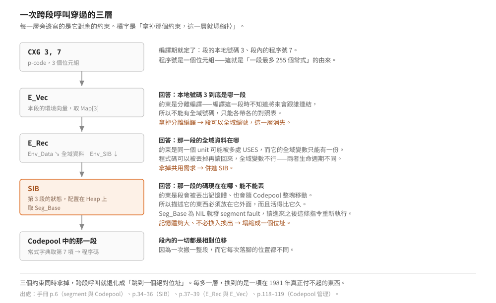

# segment 為什麼這樣切

一次跨段呼叫要穿過三層間接才找得到程式碼：環境向量、環境記錄、段資訊區塊。
看起來很繞。

> 延伸閱讀：[p-machine 是什麼](what-is-a-p-machine.md)｜
> [程序呼叫怎麼進行](procedure-call.md)｜
> [Code Segment 格式](../50-iv-internals/code-segment-format.md)｜
> [Codefile 組織與執行環境](../50-iv-internals/codefile-and-environments.md)

結論先講：**三層各自對應一個不能合併的約束**，拿掉任何一個約束，對應那一層就塌縮掉。
分離編譯逼出環境向量、「同一份全域資料」逼出環境記錄、「程式碼會被丟掉又搬回來」
逼出段資訊區塊。它們不是抽象層次的堆疊，是三個具體問題各自的最小代價。

## 根本約束：程式比記憶體大

1978 年的微電腦記憶體是幾十 KB，而 p-System 要在上面同時放下作業系統、編譯器與
使用者程式。這件事直接推出一個要求：**程式必須能只有一部分在記憶體裡**。

於是需要一個「換入換出的單位」。這個單位就是 segment。接下來的每一個設計，
都是在回答「這個單位該長什麼樣」。

## 邊界劃在哪：讓寫程式的人劃

換入換出的單位太小，簿記成本會壓過收益；太大就換不動。中間值是多少？
這個問題沒有普遍答案——它取決於哪些程序會一起被用到，而**那是程式的語意，
不是編譯器能從語法看出來的**。

UCSD 的答案是把決定權交出去：一個獨立編譯的 PROGRAM 或 UNIT 產生一個
**principal segment**，程式裡標了 `SEGMENT` 的常式與 `EXTERNAL` 的原生常式
另外產生 **subsidiary segment**（手冊 p.6）。寫程式的人用一個關鍵字說
「這一坨可以單獨換進換出」。

代價是一條硬上限：**一段最多 255 個常式**，編號 1..255（手冊 p.8）。
常式編號用一個位元組，這是[短形式運算元](../20-pcode-encoding/instruction-encoding.md)
那套密度取捨的同一個決定——省下來的是每個呼叫點的位元組，付出的是段的大小上限。

## 搬動單位必須連續，所以段內一切都是相對的

手冊 p.8 講得很直白：段內的碼與描述資訊是**連續**的，因為 segment 是碼的搬動單位，
一次載入一整段。

「一次搬一整塊」這個要求，決定了[段的版面](../50-iv-internals/code-segment-format.md)：
常式字典、常數池、程式碼、relocation list 全部塞在同一塊連續記憶體裡，
段頭放的是**段內相對指標**（常式字典指標、常數池指標、relocation list 指標）。

不能放絕對位址——理由在下一節：這一塊會移動。

## 這一塊真的會動

Codepool 夾在 Stack 與 Heap 中間。Heap 或 Stack 要空間時，管理常式**先試著整塊搬動
Codepool**，搬不出空間才開始把 segment 換出去（手冊 p.118）。手冊列了五種會動到
Codepool 的情況（p.119），其中三種只是搬位置、兩種要真的丟掉 segment。

所以段內的一切參照都不能是絕對位址：

- **常式的入口**：用段內偏移，經常式字典查。
- **回返點**：用「程序號 + 段內偏移」，也就是 Mark Stack 的 `MSPROC` 與 `MSIPC`
  （推導見[程序呼叫](procedure-call.md#第二個問題程式碼在哪)）。
- **不能重定位的原生碼放不進 Codepool**，只能在 associate 時放到 Heap 上（手冊 p.118）。
  這不是特例，是同一條約束的邊界：進不了 Codepool 的東西，就享受不到換入換出。

## 第一層：SIB——那一段現在在哪、能不能丟

段會被丟出記憶體。那麼「它在磁碟的哪個 block」「它現在在不在記憶體」這些資訊，
必須在**它不在的時候**還讀得到。

這一句話就決定了 SIB 的位置：**SIB 配置在 Heap 上，不在 segment 裡面**
（手冊 p.34）。描述一個東西的資料，必須活得比被描述者久。

同一條理由也決定了它的唯一性：**每個 code segment 只有一個 SIB，
不管有多少 segment 在用它**（手冊 p.34）。SIB 存的是「這一段目前的狀態」，
狀態必須唯一——兩份拷貝會讓兩個使用者看到不一致的 `Seg_Base`。

`Residency` 有一個容易看漏的細節：它不是布林值，是計數。程式宣告 `MEMLOCK` 加一、
宣告 `MEMSWAP` 減一，**歸零才真正變回可換出**（手冊 p.35）。
因為鎖定的請求可能來自巢狀的多個地方，用布林值會讓內層的解鎖踩掉外層的鎖。

再看丟棄的決策要用到哪些欄位。SIB 裡有三個數字，分別回答三個**不同**的問題：

| 欄位 | 回答的問題 | 為什麼不能併進別的 |
|---|---|---|
| `Ref_Count` | 現在能不能丟？ | 未完成的跨段呼叫數。大於 0 表示有人正踩在上面，丟了就回不來 |
| `Residency` | 准不准丟？ | 程式明確要求的鎖定，與使用頻率無關 |
| `Activity` | 該不該丟？ | 使用熱度，各種事件各加 6（手冊 p.35） |

三者的獨立性可以用一個情形檢驗：**一段剛被呼叫進去、Activity 還很低，但絕對不能丟**。
只看熱度會丟錯，只看 `Ref_Count` 又不知道該優先丟誰。

## 第二層：E_Vec——本地編號，因為分離編譯

跨段呼叫的指令帶的是 segment **號碼**（`CXG UB_1, UB_2` 的 `UB_1`）。
這個號碼是哪來的？

手冊 p.37 說：**segment number 只有本地意義**。一段只能參考那些被指派了
本地 segment number 的段。

為什麼不給每段一個全域唯一的號碼？因為編譯單元是**分開編譯**的。
編譯 unit A 的時候，不知道它將來會跟誰一起連結、也不知道那時候還有哪些段存在。
全域編號需要一個中央登記處，而分離編譯的整個重點，就是不要有中央登記處。

於是每一段帶自己的一張小表：**Environment Vector**（`E_Vec`），
以本地 segment number 索引，指向那一段的環境記錄（手冊 p.37）。
編譯期只要保證「本檔案內部號碼不撞」就好，連結期再把號碼接到實際的段。

這張表的一個小地方也值得看：`Map` 陣列從 **1** 開始，`Vec_Length` 就當成佔了第 0 格
（手冊 p.38）。理由手冊寫明了——為了少做一次索引運算。省的是每次跨段呼叫的一次減法。

## 第三層：E_Rec——同一個 unit 的全域資料只有一份

有了「號碼 → 哪一段」，為什麼還要中間再隔一層 `E_Rec`？

因為一段的「身分」不只是它的程式碼。它還有**全域資料**，而全域資料的生命週期
與程式碼不同：程式碼可以被丟出記憶體再讀回來，全域變數不行——丟了值就沒了。
所以 `E_Rec` 同時拿著兩個指標：`Env_Data` 指向 Heap 上的全域資料，
`Env_SIB` 指向那一段的 SIB（手冊 p.37）。

更關鍵的是共用。同一個 unit 可能被好幾個地方 `USES`，而 Pascal 的語意要求
**它的全域變數只有一份**。這件事由 `Build_Env` 保證：建立環境時先查 `Unit_List`，
已經在裡面就把 `Link_Count` 加一並**回傳既有的那一筆**，不是做一份新的
（手冊 p.38）。程式結束時 `Dump_Env` 反著來，`Link_Count` 歸零才真的釋放（p.39）。

`Link_Count` 在 SIB 與 E_Rec 裡都有，語意是平行的：**有人指著我，我就不能消失**。
兩層各自管自己的生命週期，因為兩層的東西死的時機不同。

## 於是一次跨段呼叫長這樣

圖上每一層旁邊寫了它對應的約束。反過來讀就是這篇的結論：

- 沒有分離編譯 → 段可以全域編號 → **E_Vec 塌縮成一個號碼**。
- 全域資料跟程式碼一起搬、不必共用 → **E_Rec 塌縮進 SIB**。
- 記憶體夠大、不必換入換出 → 段不會消失也不會移動 → **SIB 塌縮成一個位址**。

三個約束都拿掉，跨段呼叫就退化成「跳到一個絕對位址」。
每多一層，換到的是一項在 1981 年真正付不起的東西。

## 一個反向的檢查

這套設計有一個地方看起來多餘：`Seg_Name` 同時出現在 segment dictionary（磁碟上）
與 SIB（記憶體裡），而 SIB 明明已經有 `Seg_Addr` 可以定位段。為什麼還要帶名字？

因為**號碼是本地的，名字才是跨檔案的**。作業系統在 associate 時要把
「unit A 引用的第 3 號段」對到「某個 codefile 裡的某一段」，能拿來比對的只有名字
（手冊 p.8：名稱給作業系統在 associate time 處理跨段參考、以及 LIBRARY 維護 codefile 用）。
號碼負責執行期的快，名字負責連結期的對——兩個階段的需求不同，所以兩個都留。

判一個欄位多餘之前，先確認它服務的是不是另一個階段。

## 邊界

- 本篇的推導都建立在 IV.0 手冊的敘述上。手冊描述的是**實作策略**，
  而它自己在 p.1 聲明過那不是承諾維護的規格；某些選擇在後續版本可能不同。
- 「一段最多 255 個常式」與短形式運算元的關聯是本文的推論，
  手冊沒有把兩者寫在一起。
- IV.2.1 的 SIB／E_Rec 版面沒有從 SunDog 的位元組驗過。
  目前對得上的只有[呼叫指令的編號](../30-opcode-tables/iv0-vs-iv21.md)。
