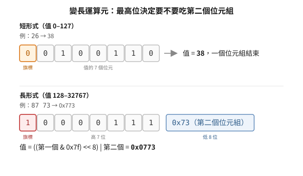

# p-code 的指令編碼：從記憶體稀缺推導出來的形狀

UCSD p-code 的每一個編碼決定，都能從一個約束逼出來：**1978 年的目標機器只有幾十 KB 記憶體**。
先看那個約束，再看編碼，會發現幾乎沒有別的選擇。

> 延伸閱讀：[p-machine 是什麼](../10-p-machine/what-is-a-p-machine.md)、
> [opcode 表與版本陷阱](../30-opcode-tables/version-traps.md)

## 根本問題

UCSD p-system 要解的問題是「同一份程式跑在 Apple II、PDP-11、Z80、68000 上」。
做法是編譯成一台**虛擬機**的指令，各平台各寫一份直譯器。

這帶來一個代價：直譯比原生碼慢。當年可以接受，因為換到的是可攜性。
但另一個代價不能接受——**如果 p-code 比原生碼還大，這條路就走不通**：
Apple II 的使用者記憶體是 48 KB，一個 Pascal 編譯器加上被編譯的程式必須一起塞進去。

所以 p-code 的設計目標不是「執行快」，是**指令密度**。這一條決定了下面每一件事。

## 推導一：常數為什麼不需要 opcode

統計任何一段 Pascal 程式，出現頻率最高的動作是「把一個小整數推上堆疊」——
陣列索引、迴圈邊界、欄位偏移、布林值，全是小數字。

如果每個常數都要一個 opcode 加一個運算元，那就是兩個位元組。
但注意：**opcode 空間有 256 個值，而程式裡用不到 256 種不同的指令**。空間有剩。

於是把 0–127 這一半的 opcode 空間直接讓給常數本身：

- 讀到的位元組 < 128 → 它**就是**要推的值，一個位元組結束
- 讀到的位元組 ≥ 128 → 它是一個真的指令

代價是指令只剩 128 個編碼可用。省下來的是每個小常數一個位元組——以 Pascal 程式的
常數密度，這筆交易穩賺。

證據在 I.5 直譯器的主迴圈（`mainop.mac`）：

```asm
SLDCI:  MOV     R0,-(SP)        ; PUSH THE LIT VALUE AND FALL INTO NEXT OP
BACK:   GETNEXT                 ; GET NEXT INSTRUCTION BYTE
        BPL     SLDCI           ; IF POSITIVE THEN A SHORT LDCI
        ASL     R0              ; DOUBLE FOR WORD INDEXING
        MOV     XFRTBL(R0),PC   ; TRANSFER CONTROL TO PROPER OP
```

`BPL`（branch if plus）是這裡的全部機關。位元組取進來當**有號數**看：0–127 是正的，
128–255 是負的。所以「這是常數還是指令」不必額外判斷，一個條件分支就分完了，
而且常數那條路徑連查表都省掉——直接推值、回主迴圈。

`ASL R0` 把負的 opcode 乘二當 word 索引，配上 `XFRTBL = . + 400`（八進位 400 = 256）
這個以負索引定址的表基底：opcode 128 剛好落在表的第 0 筆。**一個乘法一個載入完成 dispatch**，
沒有比較、沒有邊界檢查。

## 推導二：變數載入為什麼把編號編進 opcode

第二高頻的動作是「載入區域變數」與「載入全域變數」。同樣的邏輯再用一次：
把**變數編號直接編進 opcode 值**。

I.5 的分配（來自官方反組譯器 `CODESTAT` 的 `SHORTOP`）：

| opcode 範圍 | 指令 | 運算元 |
|---|---|---|
| 0–127 | `SLDC` | 就是 opcode 值本身（0–127） |
| 216–231 | `SLDL` | opcode − 215，即區域變數 1–16 |
| 232–247 | `SLDO` | opcode − 231，即全域變數 1–16 |
| 248–255 | `SIND` | opcode − 248，即間接取值偏移 0–7 |

一個位元組載入前 16 個區域變數。Pascal 的程序通常沒有超過 16 個區域變數，
所以絕大多數載入都命中這個短形式。

直譯器連迴圈都不寫，用組譯器的 `.IRP` 巨集把 16 份展開成 16 段：

```asm
SLDLS:  .IRP    N,<1,2,3,4,5,6,7,10,11,12,13,14,15,16,17,20>
        MOV     <N+N>+MSDLTA(MP),-(SP)
        BR      BACK
        .ENDR
```

展開後每個短載入是「一個 MOV 加一個 BR」。這是**用程式碼空間換執行時間**——
在一台記憶體吃緊的機器上刻意反向操作，說明這條路徑有多熱。

（`.IRP` 的參數是八進位：`10` 是 8、`20` 是 16。）

## 推導三：大於 127 的運算元怎麼辦

有些運算元放不進一個位元組：全域變數編號可能超過 255、跳躍位移可能很遠、
段的資料量以 word 計。但**大多數時候它們很小**。

固定用兩個位元組是浪費；固定用一個位元組又不夠。所以用變長編碼，
代價是解碼要多一個判斷：

```pascal
FUNCTION GETBIG:INTEGER;
VAR  BIG:HEXTYPE;
     FIRSTBYTE:BYTE;
BEGIN
  FIRSTBYTE:=GETBYTE;
  IF FIRSTBYTE>127 THEN
    BEGIN
      BIG.LOWBYTE:=GETBYTE;
      BIG.HIBYTE:=FIRSTBYTE - 128;
      GETBIG:=BIG.WORD;
    END
  ELSE GETBIG:=FIRSTBYTE;
END;
```

規則一句話：**第一個位元組最高位為 0 就是它本身（0–127）；為 1 就再吃一個位元組，
值是 `((第一個 & 0x7f) << 8) | 第二個`**（最大 0x7FFF）。

<p align="center"></p>

注意這裡的取捨與推導一是**同一個機關的兩次使用**：最高位當旗標。
在 opcode 位置它分「常數/指令」，在運算元位置它分「一個位元組/兩個位元組」。
一致的慣例讓直譯器可以共用同一段位元判斷。

## 這對反組譯的意義

**p-code 是變長指令集**，所以：

- 不能從中間任意位置開始解碼。要從程序進入點往下走。
- 「某個位元組樣式在不在檔案裡」可以用搜尋回答；
  「這個位元組是 opcode 還是別人的運算元」**不能**，只能解碼。

這是一個實際踩過的坑：在 SunDog 的 p-code 裡掃描呼叫指令的位元組樣式，
會掃到「看起來像呼叫、其實是某個全域編號的第二個位元組」的假命中。
`80` 開頭的變長編號讓這種假呼叫特別常見，因為 `0x80`–`0xFF` 正好與指令的編碼範圍重疊。

反過來也成立：**一段位元組在整份檔案裡唯一出現，就是一個可回查的錨點**。
這是位元組簽章（byte signature）這種驗證手法的基礎——它不需要解碼就能防止「位址記錯」
與「換了一份磁碟卻沿用舊結論」。

## 邊界

本篇的一手證據全部來自 **UCSD Pascal I.5（1978，PDP-11）** 的官方原始碼：
直譯器 `mainop.mac` 與反組譯器 `CODESTAT`。

上面三條推導（常數佔低半、短載入把編號編進 opcode、運算元變長）在後續版本仍然成立，
但**具體的數值分配會變**。用 I.5 的 opcode 表去讀 IV.x 的程式碼會得到自洽但錯誤的結果——
細節見 [opcode 表與版本陷阱](../30-opcode-tables/version-traps.md)。
