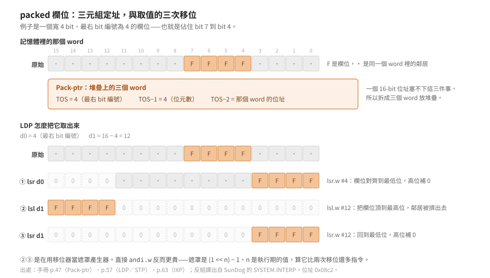

# packed 欄位：一個位址塞不下的東西

Pascal 的 `packed` 讓好幾個小欄位擠進同一個 word。但 p-machine 的載入與儲存指令
都以 word 為單位——它要怎麼定址「某個 word 裡的第 4 到第 7 個 bit」？

> 延伸閱讀：[指令編碼](instruction-encoding.md)｜
> [逐條驗證：98 個處理常式](../30-opcode-tables/iv21-routine-audit.md)｜
> [IV 版指令逐條語意](../50-iv-internals/instruction-set-details.md)

結論先講：**位址被拆成三個 word 放在堆疊上**。這個決定又反過來決定了三件事——
`LDP`／`STP` 為什麼一個運算元都不需要、`IXP` 為什麼需要兩個、
以及那三個常式為什麼通篇都在移位而看不到任何遮罩常數。

## 為什麼一個 word 裝不下

要指到一個位元欄位，至少得說清楚三件事：

1. 哪一個 word；
2. 從第幾個 bit 開始；
3. 幾個 bit 寬。

在 16-bit 的機器上，光是「哪一個 word」就用掉整整一個 word 的表示範圍。
要把三件事塞進一個 word，只能犧牲其中一項的範圍——例如限制陣列大小，
或限制欄位不得跨越某個邊界。

IV.0 選的是不犧牲：**把「packed field 的位址」定義成堆疊上的三個 word**，
手冊叫它 `Pack-ptr`（手冊 p.47）：

| 位置 | 內容 |
|---|---|
| TOS | 欄位最右邊那個 bit 的編號 |
| TOS−1 | 欄位的位元數 |
| TOS−2 | 那個 word 的位址 |

代價是每次存取要推三個值。換到的是欄位寬度與位置完全不受限制。

## 於是 `LDP` 與 `STP` 不需要運算元

三個值都在堆疊上，指令自己不必帶任何東西：

| 指令 | opcode | 運算元 | 堆疊效應 |
|---|---|---|---|
| `LDP` | 201（`0xc9`） | 無 | `<pack-ptr>:<word>` |
| `STP` | 202（`0xca`） | 無 | `<pack-ptr,word>:<>` |
| `IXP` | 216（`0xd8`） | `UB_1, UB_2` | `<addr,word>:<pack-ptr>` |

`IXP` 是唯一帶運算元的一個，而它帶的兩個都是**編譯期就知道的常數**：
每個 word 裝幾個元素（`UB_1`）、欄位幾個 bit 寬（`UB_2`）。
執行期才知道的索引則從堆疊來。

**編譯期知道的走運算元、執行期才知道的走堆疊**——這條分工在整個指令集裡一致，
packed 欄位這一組把它示範得最清楚。

## `IXP`：一個除法回答兩個問題

`IXP` 要把「陣列基底 + 索引」變成上面那個三元組。SunDog 那份 IV.2.1 直譯器的實作：

```
0972: 7200         moveq  #0,d1
0974: 121c         move.b (a4)+,d1     ; UB_1：每個 word 裝幾個元素
0976: 7400         moveq  #0,d2
0978: 341f         move.w (sp)+,d2     ; 索引
097a: 84c1         divu.w d1,d2        ; 商 = 第幾個 word，餘數 = word 內第幾格
097c: d442         add.w  d2,d2        ; 商 ×2 → byte 偏移
097e: d557         add.w  d2,(sp)      ; 加到基底位址 → 三元組的 TOS-2
0980: 121c         move.b (a4)+,d1     ; UB_2：欄位寬度
0982: 3f01         move.w d1,-(sp)     ; → 三元組的 TOS-1
0984: 4842         swap   d2           ; 取餘數（68000 的 divu 把餘數放高半）
0986: c2c2         mulu.w d2,d1        ; 餘數 × 寬度 = 最右 bit 編號
0988: 3f01         move.w d1,-(sp)     ; → 三元組的 TOS
098a: 4ed5         jmp    (a5)
```

關鍵是第 5 行。68000 的 `divu.w` 把商放進低半、餘數放進高半，**一次除法同時回答
「哪一個 word」與「那個 word 裡的第幾格」**。接著只要 `swap` 就取到餘數。

推上去的次序是位址、位元數、最右 bit 編號——正是 `LDP`／`STP` 期待的三元組。

## `LDP`：為什麼是三次移位

```
08c2: 301f         move.w (sp)+,d0     ; TOS   = 最右 bit 編號
08c4: 7210         moveq  #$10,d1
08c6: 925f         sub.w  (sp)+,d1     ; d1 = 16 − 欄位位元數
08c8: 3e17         move.w (sp),d7      ; TOS-2 = word 位址
08ca: 34367800     move.w (a6,d7.l),d2 ; 取出那個 word
08ce: e06a         lsr.w  d0,d2        ; ① 把欄位右移到最低位
08d0: e36a         lsl.w  d1,d2        ; ② 左移 16−n，把欄位頂到最高位
08d2: e26a         lsr.w  d1,d2        ; ③ 右移 16−n，回到最低位
08d4: 3e82         move.w d2,(sp)
08d6: 4ed5         jmp    (a5)
```

①把欄位對齊到最低位；②③是把欄位以外的高位清掉。

為什麼不直接 `andi.w #遮罩`？因為**遮罩得先算出來**。欄位寬度 `n` 是執行期的值，
遮罩是 `(1 << n) − 1`；68000 沒有辦法用一個立即值做變數位移，
算這個遮罩要一條 `moveq` 加一條變數 `lsl` 再加一條 `subq`——比兩條移位還貴。

**左移再右移，等於用移位器當遮罩產生器。** 這個手法在整份直譯器裡出現不只一次。

## `STP`：XOR 兩次等於替換

存回去麻煩一些：要換掉欄位、又不能動到同一個 word 裡的鄰居。

```
08d8: 301f         move.w (sp)+,d0     ; 要存的資料（靠右對齊）
08da: 321f         move.w (sp)+,d1     ; 最右 bit 編號
08dc: 7410         moveq  #$10,d2
08de: 945f         sub.w  (sp)+,d2     ; d2 = 16 − 欄位位元數
08e0: 3e1f         move.w (sp)+,d7     ; word 位址
08e2: 36367800     move.w (a6,d7.l),d3 ; 取出原本的 word
08e6: e26b         lsr.w  d1,d3        ; 對齊到欄位
08e8: b143         eor.w  d0,d3        ; 原欄位 ⊕ 新值 = 要翻轉的位元
08ea: e56b         lsl.w  d2,d3        ; 左移 16−n
08ec: 9441         sub.w  d1,d2        ; 16 − n − 最右 bit 編號
08ee: e46b         lsr.w  d2,d3        ; 右移回欄位原本的位置
08f0: b7767800     eor.w  d3,(a6,d7.l) ; 翻轉那些位元
08f4: 4ed5         jmp    (a5)
```

用的是 `原 ⊕ (原 ⊕ 新) = 新`。中間那兩次移位（⑧⑩）把「要翻轉的位元」限制在欄位範圍內，
所以最後一行 XOR 回去時，欄位外的位元全部乘上 0、不受影響。

比起「先 `AND` 清掉欄位、再 `OR` 寫入新值」，這個寫法**同樣省掉了算遮罩那幾條指令**，
而且只讀一次、寫一次記憶體。

## 三個常式的共同點

<p align="center"></p>

`IXP` 用 `divu` 的餘數、`LDP` 用「左移再右移」、`STP` 用「XOR 兩次」——
三個都在做同一件事：**避開算遮罩**。

這不是巧合。1981 年的 68000 沒有位元欄位指令，而遮罩是一個要花指令去產生的值；
移位器與 XOR 都是現成的。一個把 `packed` 當成語言特性的系統，
如果每次欄位存取都要先算一個遮罩，`packed` 省下來的記憶體會被指令數吃掉。

## 一個曾經寫錯的斷言

這個 repo 的待辦表從 R1 起就寫著「SunDog 那版的運算元順序與手冊相反」，
[逐格對照](../30-opcode-tables/iv0-vs-iv21.md)還把它誤植到 `SCXG` 上。

實測不成立。上面三段碼裡，`LDP` 第一個 pop 的是最右 bit 編號、第二個是位元數、
第三個是位址，與手冊 `Pack-ptr` 的定義逐項相同；`STP` 多 pop 一個資料在最前面，
也與手冊的 `<pack-ptr,word>` 一致；`IXP` 推出來的次序同樣對得上。

原始斷言寫在拿到 IV.0 手冊之前，當時的「手冊」是什麼並沒有記下來。
**沒有記來源的斷言，事後沒辦法判斷它是被推翻還是根本沒成立過。**
推翻紀錄見 `PLAN.md` 的勘誤表。

## 邊界

- 上面三段碼來自 SunDog 的 IV.2.1 直譯器。IV.0 手冊只定義語意，不規定實作手法；
  別的移植版可能用遮罩而不是移位。
- 欄位不得跨越 word 邊界這件事，手冊沒有明寫，但 `IXP` 用 `divu` 算「第幾個 word」
  這個作法只有在欄位不跨界時才成立。編譯器怎麼保證，本篇沒有追。
