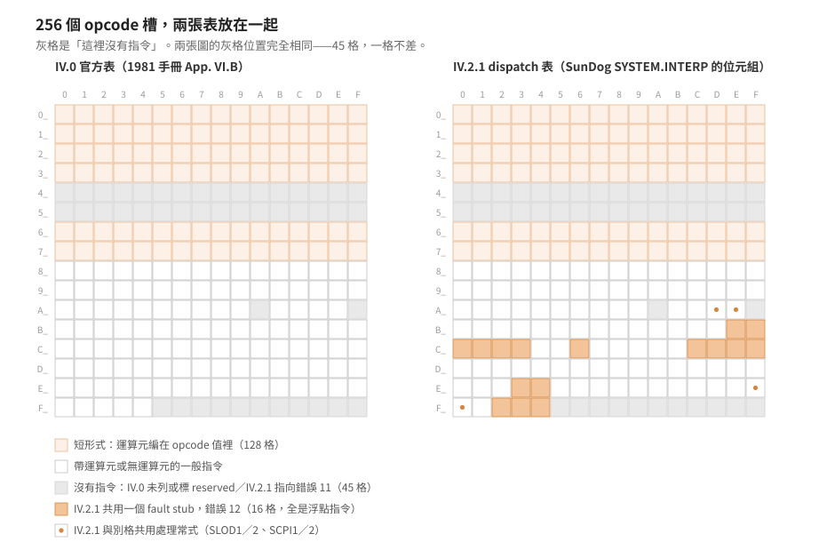

# 逐格對照：IV.0 官方表 × IV.2.1 dispatch 表

把 1981 年手冊印的 IV.0 opcode 表，與 1985 年 SunDog 那份直譯器實際的 256 項 dispatch 表
放在一起，一格一格比。

> 延伸閱讀：[opcode 表與版本陷阱](version-traps.md)｜
> [實例：解出一份 1985 年 68000 直譯器的 opcode 表](sundog-ivx-table.md)｜
> [IV.0 官方 opcode 表](../50-iv-internals/appendix-opcodes.md)

結論先講：**IV.0 表列出的 211 個指令，與 IV.2.1 有處理常式的 211 個槽，逐格重合，
沒有一格例外。** 兩邊「這裡沒有指令」的 45 格也在同樣的位置。
所以 IV.2.1 沒有動 IV.0 的編號——`0x80`–`0xff` 這段主表可以直接照 IV.0 的表讀。

不過重合不等於等價：那 211 格裡有 16 格，IV.2.1 全部導到同一個 fault，
**這份直譯器沒有實作浮點運算**。

<p align="center"></p>

## 怎麼做的

三步，都可以重跑——整條管線收在 [`tools/dispatch-crosstab.py`](../../tools/README.md)。

**一、從位元組抽 dispatch 表。** 表在 `SYSTEM.INTERP` 檔內位移 `0xec`，256 項，
每項兩個位元組 big-endian，值就是處理常式的檔內位移（基底對齊的推導見
[實例篇第 2 步](sundog-ivx-table.md)）：

```python
tbl = [struct.unpack_from('>H', data, 0xec + 2*i)[0] for i in range(256)]
```

抽出來得到 107 個相異目標、45 個槽指向 `0x304`。這兩個數字與實例篇當初用 IDA 解出來的
一致，等於換一條路徑重跑了一次。

**二、把官方表機讀化。** 解析 [`appendix-opcodes.md`](../50-iv-internals/appendix-opcodes.md)
的表格列，展開 `SLDL1 … SLDL16` 這種範圍寫法，得到 opcode 值 → 助記符的對應。
解析結果 217 筆涵蓋 217 個相異 opcode 值——**沒有任何一個值被列兩次**，
這是摘譯本身的一致性檢查。

**三、交叉表。** 兩邊各分成「有指令」與「沒有指令」，比對集合。

## 結果一：沒有指令的 45 格完全重合

| | 格數 | 位置 |
|---|---|---|
| IV.0 手冊完全沒提 | 39 | `0x40`–`0x5f`、`0xaa`、`0xaf`、`0xf5`–`0xf9` |
| IV.0 標 `reserved` | 6 | `0xfa`–`0xff` |
| IV.2.1 指向錯誤 11 的常式 | 45 | `0x40`–`0x5f`、`0xaa`、`0xaf`、`0xf5`–`0xff` |

兩邊都是那 45 格，位置一格不差。`0x40`–`0x5f` 那段連續 32 格的留白尤其明顯：
它夾在短形式中間（`SLDO` 結束於 `0x3f`，`SLLA` 從 `0x60` 開始），
是刻意留給未來擴充短形式的空間，兩版都沒有用掉。

反過來看，這也是「IV.2.1 沿用 IV.0 編號」最強的單一證據。留白的位置是任意的——
如果 IV.2.1 重排過編號，這 45 格沒有理由落在同樣的地方。

## 結果二：107 個目標的組成

| 類別 | 目標數 | 涵蓋格數 |
|---|---|---|
| 錯誤 11（未實作指令） | 1 | 45 |
| 浮點 fault（錯誤 12） | 1 | 16 |
| 短形式的群常式 | 7 | 95 |
| 兩格共用（`SLOD1`／`SLOD2`、`SCPI1`／`SCPI2`） | 2 | 4 |
| 專屬常式 | 96 | 96 |

合計 107 個目標、256 格。

`0x00`–`0x7f` 這 128 格的內部分佈是：7 個群常式吃掉 95 格、`0x40`–`0x5f` 那 32 格是錯誤、
剩下 `0x78`（`SIND0`）自己一個常式。短形式那一段沒有例外，整段都由「值即運算元」的
群常式處理。

兩格共用的那兩對很說明問題：`SLOD1`/`SLOD2` 是「回溯一層／兩層靜態鏈」，
`SCPI1`/`SCPI2` 是「呼叫本段程序，參數一個／兩個 word」——**成對的指令共用常式，
差別由 opcode 值本身算出來**。IV.0 把它們編成相鄰的號碼，IV.2.1 的實作就直接
利用了這個相鄰性。編號與實作是一起設計的。

## 結果三：16 格浮點全部走 fault

`0x1b68` 這個目標被 16 個 opcode 共用，內容只有一條指令：

```
1b68: 4e eb 03 08   jmp (0x308,a3)
```

而 `0x308` 是錯誤處理的入口之一：

```
0308: 70 0c         moveq #12,d0      ; 錯誤碼 12
030a: 60 10         bra.s 0x031c      ; 跳共同的錯誤處理
```

`0x304` 那個「未實作指令」用的是錯誤碼 11，兩者是不同的碼。
這 16 格照 IV.0 的表是：

`TNC` `RND` `ADR` `SBR` `MPR` `DVR` `DUPR` `FLT` `EQREAL` `LEREAL` `GEREAL`
`ABR` `NGR` `LDCRL` `LDRD` `STRL`

**全部都是浮點指令，而且是 IV.0 表裡的全部浮點指令**——沒有漏掉一個，也沒有混進
非浮點的指令。這份直譯器把整個浮點指令集導向同一個 fault。

對一款遊戲來說這是合理的取捨：Atari ST 沒有浮點協同處理器，軟體浮點又慢又佔記憶體，
而 SunDog 的遊戲邏輯用不到。錯誤碼 12 的語意（`FPIERR`，Floating point error）
不在 IV.0 這本手冊裡——執行期錯誤碼表屬於 Users' Manual——
但 [`laanwj/sundog`](https://github.com/laanwj/sundog) 的 `doc/notes.md` 從另一條路
得到同樣的結論，且明寫「Floating point operations are not implemented: These raise error 0xc」。

## 抽驗：四個常式逐行對照

集合對得上，不代表每一格的語意也對得上。挑四個運算元格式各不相同的主表指令，
把處理常式的 68000 碼與 IV.0 的定義並排。

**`LDCN`（`0x98`，無運算元）** — IV.0：「Load Constant NIL。推 NIL；此值依處理器而異。」

```
0506: 3f 3c 00 00   move.w #0,-(sp)     ; 這個處理器上 NIL = 0
050a: 4e d5         jmp    (a5)         ; 回主迴圈
```

沒有動 `a4`（p-code 指標），與「無運算元」相符。

**`LDCB`（`0x80`，`UB` 運算元）** — IV.0：「Load Constant Byte。推 UB，高位元組補零。」

```
050c: 70 00         moveq  #0,d0        ; 先清乾淨——這就是「高位元組補零」
050e: 10 1c         move.b (a4)+,d0     ; 吃一個位元組
0510: 3f 00         move.w d0,-(sp)
0512: 4e d5         jmp    (a5)
```

**`LDCI`（`0x81`，`W` 運算元）** — IV.0：「Load Constant Word。推 W。」
而 `W` 的定義是「兩個位元組，16-bit 二補數，**永遠低位元組在前**」（手冊 p.46）。

```
0514: 10 1c         move.b (a4)+,d0     ; 第一個位元組
0516: 3f 00         move.w d0,-(sp)     ; 連同 d0 的高位元組一起推上去
0518: 1e 9c         move.b (a4)+,(sp)   ; 第二個位元組蓋掉堆疊頂的高位元組
051a: 4e d5         jmp    (a5)
```

68000 是 big-endian，`(sp)` 指的是那個 word 的**高**位元組。所以先讀的位元組留在低位、
後讀的蓋進高位——**「低位元組在前」這條手冊規則，可以直接從這三行讀出來**。

順帶一提第 2 行的手法：進常式時 `d0` 是 opcode×2（這裡是 `0x102`），
所以推上去的 word 高位元組是垃圾。它不清、也不用第二個暫存器組字，
直接把堆疊上那一格當暫存空間，下一行蓋掉。省一條指令。

**`STL`（`0xa4`，`B` 運算元）** — IV.0：「Store Local Word。把 TOS 存入本地活動記錄偏移 B 的 word。」

```
0586: 70 00         moveq  #0,d0
0588: 10 1c         move.b (a4)+,d0     ; 變長運算元第一個位元組
058a: 6a 08         bpl.s  0x0594       ; 最高位是 0 → 值就是它本身
058c: 02 00 00 7f   andi.b #$7f,d0      ; 否則清掉最高位
0590: e1 48         lsl.w  #8,d0        ; 當高位元組
0592: 10 1c         move.b (a4)+,d0     ; 再吃一個當低位元組
0594: d0 40         add.w  d0,d0        ; word 編號 → byte 偏移
0596: 31 9f 08 08   move.w (sp)+,(8,a0,d0.l)
059a: 4e d5         jmp    (a5)
```

三件事同時對上：變長運算元的解碼規則、`(sp)+` 表示這是**存**不是載入、
以及 `8(a0,d0.l)` 這個框內定址。最後這點與短形式 `SLDL` 用的是同一種定址：

```
0534: 04 40 00 3e   subi.w #$3e,d0             ; opcode×2 − 0x3e = (n−1)×2
0538: 3f 30 08 08   move.w (8,a0,d0.l),-(sp)   ; 同樣的 8(a0,d0.l)，方向相反
053c: 4e d5         jmp    (a5)
```

四個抽驗全部與 IV.0 的文字定義相符，沒有一個需要另作解釋。

## 第三方比對：`laanwj/sundog`

[`laanwj/sundog`](https://github.com/laanwj/sundog)（MIT）的 `doc/notes.md` 有一份從同一款
遊戲獨立整理的 IV.2.1 opcode 表。把它當第三個來源：

**浮點那 16 格完全一致。** 該文件把 16 個 opcode 標成「Not implemented (error 0xc)」，
與從位元組判定「指向 `0x1b68` 這個 fault stub」的 16 格是同一組，一格不差。
兩條路徑——讀 dispatch 表的位元組、讀該作者的整理——得到同一個答案。

**助記符拼法有 14 處不同。** 這一類差異值得單獨記，因為它會讓人以為兩份表在講不同的東西：

| opcode | IV.0 手冊 | `laanwj/sundog` |
|---|---|---|
| `0x90` `0x91` `0x92` | `CPL` `CPG` `CPI` | `CLP` `CGP` `CIP` |
| `0xef` `0xf0` | `SCPI1` `SCPI2` | `SCIP1` `SCIP2` |
| `0x8b` | `JPL` | `UJPL` |
| `0xa8` | `NAT` | `NATIVE` |
| `0xb9` `0xba` `0xbb` | `EQBYT` `LEBYT` `GEBYT` | `EQBYTE` `LEBYTE` `GEBYTE` |
| `0xbe` `0xbf` | `TNC` `RND` | `TRUNC` `ROUND` |
| `0xc6` | `DUPR` | `DUP2` |
| `0xf3` | `LDRD` | `LDRL` |

`CPL`/`CPG`/`CPI` 這組最容易誤判成轉錄錯誤——手冊自己的說明寫的是
「Call **L**ocal **P**rocedure」，照字首應該是 `CLP`。回查 [`refs/`](../../refs/README.md)
掃描的印刷頁 141，手冊確實印 `CPL`；`LDRD`（p.139）與 `NAT`（p.142）也都與摘譯一致。
**是手冊自己的拼法與它自己的說明對不起來**，不是誰抄錯。
`laanwj/sundog` 用的是與字首一致的慣用拼法。

查 opcode 表時碰到這類差異，先確認是同一個編號再說——編號是硬的，助記符是人取的。

## 這證明了什麼，還沒證明什麼

**證明了**：IV.2.1 的 opcode 編號與 IV.0 相同。依據是三層獨立的證據——
45 格留白位置完全一致、成對指令共用常式的方式與 IV.0 的相鄰編號吻合、
四個抽驗的常式逐行符合 IV.0 的定義。拿 IV.0 的表讀 IV.2.1 的 p-code，是站得住的。

**語意層另外驗**：編號相同不保證語意相同。這一篇只到編號為止；
98 個常式的逐條語意驗證在[逐條驗證](iv21-routine-audit.md)，結論是全部相符。

**方法上的限制**：第二步比對的是[摘譯](../50-iv-internals/appendix-opcodes.md)，
不是手冊掃描本身。摘譯通過了三道檢查——沒有 opcode 值重複、四個抽驗的常式行為相符、
與 `laanwj/sundog` 有出入的三處（`CPL`、`LDRD`、`NAT`）回查掃描後確認摘譯正確——
但仍不等於逐行核對過整張表。有疑問的格子要回查 [`refs/`](../../refs/README.md) 的掃描：
印刷頁 138–142，PDF 頁碼加 6。
