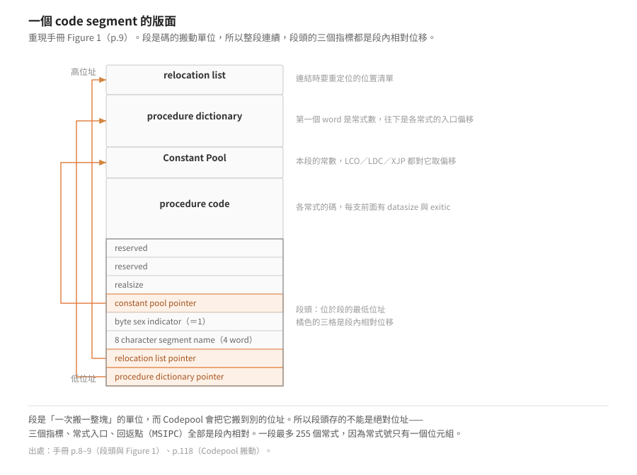

# Code Segment 格式

> 來源：SofTech Microsystems《UCSD p-SYSTEM and UCSD PASCAL Version IV.0
> INTERNAL ARCHITECTURE GUIDE》（1981 年 3 月第一版），出自 Chapter I
> （Introduction）與 Chapter II「The P-Machine」的 II.1～II.2.1.6，
> 涵蓋印刷頁 1–21（實測印刷頁碼 = PDF 頁碼 − 6）。p.22 起接
> [Codefile 組織與執行環境](codefile-and-environments.md)。

> 延伸閱讀：[本層索引](README.md)｜[p-machine 是什麼](../10-p-machine/what-is-a-p-machine.md)（segment 在解決什麼問題）

## Chapter I：簡介（手冊 p.1–3）

這本指南描述 UCSD p-System 的內部設計：P-machine、作業系統、基本 I/O，
以及這些元素如何組織起來執行 UCSD Pascal（或 BASIC、FORTRAN）寫的程式。
定位是「進階使用者的指南與參考」，**不是**給實作者的獨立規格書（手冊 p.1）。
SofTech 聲明它承諾維護的是《Users' Manual》描述的使用者層功能，而不是本書
描述的實作策略；「利用 internal tricks 的程式設計師風險自負」（手冊 p.1）。

系統沿革（手冊 p.2–3）：1974 年底 Kenneth Bowles 在 UCSD 帶學生為微電腦
實作 Pascal；最早跑在 PDP-11/10 配軟碟與 VT-50 終端機上。直譯式執行從一開始
就存在；p-code 改編自 Urs Ammann（ETH Zürich）的原始設計，目標是緊湊、
容易由編譯器產生，並讓編譯器與 codefile 盡量小。最早的實作都在
PDP-11/LSI-11 上，之後才移植到 8080、Z80 與其他處理器。後來由 SofTech
Microsystems 接手維護與授權。

## Chapter II.1：P-machine 概觀（手冊 p.5–7）

### II.1 與 II.1.1 Interpretive Execution（手冊 p.5）

- P-machine 是一台理想化的機器；作業系統本身、Filer 等系統程式、編譯出來的
  使用者程式全都跑在 P-machine 上。系統裡的 codefile 不是 p-code 就是
  native code（特定實體處理器的碼）（手冊 p.5）。
- p-code 設計目標是**緊湊**（比等價 native code 短很多）且**容易被編譯器
  產生**；因為緊湊又簡單，把 P-machine 實作到各種真實處理器上相對容易，
  這是 p-System 可移植性的關鍵（手冊 p.5）。
- 「P」代表 “pseudo”。P-machine 可以是實體處理器，也可以由直譯器模擬；
  直譯器是以某特定處理器的 native code 寫成的程式，負責逐條執行 p-code
  指令並控制機器相關的 I/O。開機（bootstrap）= 載入直譯器（若需要）並啟動它，
  下一步是呼叫作業系統（手冊 p.5）。

### II.1.2 Stack 與 Heap（手冊 p.5–6）

- 系統把常駐記憶體的資料放在兩個動態結構：**Stack** 放靜態變數、程序/函式
  呼叫的簿記資訊、運算式求值；**Heap** 放動態變數，包括描述程式環境的結構
  （手冊 p.5）。
- Stack 可視為 P-machine 的一部分（大多數 p-code 指令都會動到它）；Heap
  是系統的一部分，但主要由作業系統而非 P-machine 支援（手冊 p.6）。
- Stack 與 Heap 都在主記憶體、彼此相向成長，「（大致上）First-In-First-Out」。
  兩者之間是一塊部分未使用、但包含 **Codepool** 的區域（手冊 p.6）。

### II.1.3 Code Segments（手冊 p.6）

- 程式碼存在一或多個 segment 裡；一個 segment 可含 p-code、native code 或
  兩者混合。除了碼本身，每個 segment 還有給系統用的簿記資訊，以及（通常）
  一個常數池（手冊 p.6）。
- 每個「編譯單元」（獨立編譯的 Pascal PROGRAM 或 UNIT）產生一個
  **principal segment**；若程式含 `SEGMENT` 常式或 `EXTERNAL` native 常式，
  還會有 **subsidiary segments**（手冊 p.6）。
- 執行（eX(ecute)）程式時，作業系統讀取 codefile 內嵌的參考資訊，找出所有
  需要的編譯單元（含 subsidiary segments 與 UNIT 引用 UNIT 這種間接參考），
  建立執行期跨段參考（如程序呼叫）用的表（手冊 p.6）。
- 執行中的各 segment 與 Stack、Heap 競爭主記憶體；跨段呼叫成功的前提条件是
  **呼叫方與被呼叫方的 segment 都必須在主記憶體中**（手冊 p.6）。
- 主記憶體中的 segment 全部連續存放在 Stack 與 Heap 之間的 **Codepool**，
  Codepool 可被搬動以騰出空間；Codepool 的管理在 Chapter IV（手冊 p.6）。

### II.1.4 Device I/O（手冊 p.7）

- 裝置 I/O 由語言層呼叫直譯器內的常式完成；直譯器的 I/O 常式再呼叫
  直譯器的 **BIOS**（Basic I/O Subsystem），BIOS 直接控制周邊硬體。
  I/O 環境相依性被隔離在 BIOS 裡，移植到新硬體只需改 BIOS，不必動整個
  直譯器（手冊 p.7）。
- 在 Adaptable Systems 上，BIOS 本身對 **SBIOS**（Simplified BIOS）有標準
  介面；SBIOS 是一組簡單 I/O 常式，讓使用者能快速把系統移植到新的 I/O 環境。
  BIOS 在 Chapter III 說明，SBIOS 在《Installation Guide》（手冊 p.7）。

## II.2.1 Code Segments（手冊 p.8–20）

### 段的基本屬性與段頭（手冊 p.8）

- 一個 code segment 是一群常式（routine）加上描述資訊；段內的碼與資訊是
  連續的，因為 segment 是碼的「搬動單位」——一次載入一整段（手冊 p.8）。
- 一段最多 255 個常式，編號 1..255（手冊 p.8）。
- 編譯時每段被指定一個**名稱**（8 字元）與一個**號碼**。名稱給作業系統在
  associate time 處理跨段參考、以及 LIBRARY 維護 codefile 時用；號碼是執行期
  參考該段用的（手冊 p.8）。
- 段的開頭（低位址）是一筆記錄，依序包含：routine dictionary 指標、
  relocation list 指標、8 字元段名（4 個 word）、byte sex 指示字、
  constant pool 指標、realsize 字、保留 2 個 word（手冊 p.8）。

### Figure 1：Executable Code Segment Format（手冊 p.9）

<p align="center"></p>

段頭在段的最低位址，三個指標（常式字典、relocation list、常數池）全部是**段內相對位移**——
因為 Codepool 會把整段搬到別的位址，絕對位址存不得。


## II.2.1.1 Code Segments and Byte Sex（手冊 p.10）

**code segment 與主機的 byte sex 無關**，靠幾個元件合作達成（手冊 p.10）。

word 導向（也就是會受 byte sex 影響）的資訊分兩類：

- **superstructure**，例如 routine dictionary。**由作業系統在載入 segment 時翻轉**。
- **embedded**，例如常數（`LDC` 取用）或 `XJP` 的 case 表。**由直譯器翻轉**。

編譯器產生的 segment，其 word 資訊是「編譯當時那台機器的自然順序」。
緊接在 8 字元段名之後有一個旗標，**在原機器的 byte sex 下永遠是常數 1**；
若以相反的 byte sex 讀，它會變成 256。作業系統載入時看這個旗標，
判定與執行中的機器相反就把 routine dictionary 逐 word 交換位元組。

淨結果是**兩種 byte sex 的 segment 都能在任何機器上跑**（手冊 p.10）。

## II.2.1.2 Routine Dictionaries（手冊 p.10）

段的第一個 word 指向 routine dictionary（也叫 procedure dictionary）的 word 0。
字典是一串指向各常式碼的指標，**每一個都是 seg-relative word pointer**。

- 段內常式編號 **1..255**，編號就是字典的索引：第 n 個 word 是常式 n 的碼的指標。
- 字典的 **word 0 是段內常式的個數**。
- `EXTERNAL` 與 `FORWARD` 常式可能只有宣告沒有碼，對應的字典項是 0（至少在 link 之前）。

## II.2.1.3 Routine Code（手冊 p.11）

一支常式的碼由兩個 word 開頭——**`DATASIZE` 與 `EXITIC`**——之後才是可執行的物件碼。
物件碼可以全是 p-code、全是原生碼，或兩者混合。

- **`DATASIZE`**：呼叫時要配置的區域資料 word 數，**不含參數**（參數呼叫前就在堆疊上了）。
  第一條可執行指令緊接在 `DATASIZE` 之後。
  **若第一條指令是原生碼，`DATASIZE` 存的是它的 one's complement**——用正負當旗標。
- **`EXITIC`**：若第一條是 p-code，它是「離開這支常式時要執行的碼」的 seg-relative byte pointer；
  若第一條是原生碼，`EXITIC` 在執行期未定義。

碼裡混用 p-code 與原生碼時，仍然由**第一條指令**決定上面兩條規則（手冊 p.11）。

**兩個 word 的實際順序是 `EXITIC` 在前、`DATASIZE` 在後，而字典項指的是 `DATASIZE`。**
手冊把它們寫成「`DATASIZE` 與 `EXITIC`」，但同一段又說「第一條可執行指令緊接在
`DATASIZE` 之後」——後面這句只有在 `EXITIC` 在前時才成立。8086 直譯器的呼叫序列
（`0x103a`：`mov cx, es:[di]` 取 `DATASIZE`，接著 `inc di; inc di` 才指到要執行的碼）
與 `SYSTEM.PASCAL` 的 430 支常式實測都指向這個順序。
逐條證據見 [`Parhelion-PME86`](https://github.com/wicanr2/Parhelion-PME86) 的
`docs/30-remake/specs/01-codefile.md` 第 5.4 節。

## II.2.1.4 The Constant Pool（手冊 p.12–15）

IV.0 把多 word 常數集中在整段共用的一個常數池，位置緊接在最後一支常式碼之後。

- 常數池指標是 **seg-relative word pointer**，緊跟在 byte sex 指示字之後，
  指向常數池的**低位址端**。指標為 0 表示這一段沒有常數池。
- 常數用「相對常數池起點（低位址）的 word 偏移」參照——`LCO`、`LDC`、`XJP` 都是這樣取值。
- 常數池分兩個子池：**real pool** 與 **main pool**。
  常數池的第一個 word 是指向 real pool 起點的 word 指標（相對常數池起點）；
  沒有實數常數時這個 word 必須是 0。real pool 的第一個 word 是實數常數的個數。

Figure 2（手冊 p.13）畫的配置由低到高是：real subpool 指標、main subpool、
實數常數個數、real subpool、main subpool——**main pool 被 real pool 夾成兩段**。

實數常數用 32-bit 或 64-bit 的 **BCD** 浮點格式（手冊 p.14）。
同樣大小的表示法可以跨處理器搬運，不同大小則不行；
一個程式裡所有編譯單元**必須**用同一個實數大小。編譯器預設 32 或 64 位元，
可用 `$R2`（2 word）／`$R4`（4 word）指令覆寫，該指令要出現在第一個非註解符號之前。
編譯當時的 realsize 會嵌進每一個 code segment——**段頭的 `REALSIZE` 字就是它**
（即使那一段完全沒有用到實數）。

## II.2.1.5 The Relocation List（手冊 p.17–20）

段內最後（最高位址）的一塊是 relocation list。段開頭的**第二個**指標指向它的
最高位址那個 word，同樣是 seg-relative word pointer；沒有 relocation list 就是 0。

手冊 p.17 有一句話直接解釋了為什麼 p-code 段可以隨便搬：

> Such absolute addresses are **only** needed by native code:
> Segments containing exclusively P-code are completely position-independent;
> no relocation list is needed.

**純 p-code 的段完全位置無關，根本不需要 relocation list。** 會用到絕對位址的只有原生碼。

relocation list 由零或多個 sublist 組成，每個 sublist 有一個 header 加零或多個
seg-relative byte pointer：

```pascal
LocTypes = (RelocEnd,   {整份 relocation list 的結束}
            SegRel,     {相對本段的基底位址}
            BaseRel,    {相對 DataSegNum 指定的資料段}
            InterpRel,  {相對直譯器的 interp-relative 表}
            ProcRel);   {相對常式第一條指令的位址}

ListHeader = PACKED RECORD
               ListSize:   integer;   {本 sublist 的指標數}
               DataSegNum: 0..255;    {BaseRel 用的本地 segment number}
               RelocType:  LocTypes;  {本 sublist 的重定位型別}
             END;
```

- sublist 可以任意順序出現，同一種型別也可以有多個 sublist。
- `ProcRel` 由組譯器產生、由 Linker 換成 `SegRel`；載入與重定位時不該再遇到它。
- `DataSegNum` 只有 `RelocType` 是 `BaseRel` 時才有意義，其餘情況應為 0。
  組譯器事先不知道 segment 號，應該填 0 交給 Linker 補（手冊 p.18）。
- 處理順序是**由高位址往低位址**，逐個 sublist 做到遇見 `RelocEnd` 為止；
  那一筆終結項的 `DataSegNum` 與 `ListSize` 都應該是 0（手冊 p.20）。

## II.2.1.6 Segment Reference List（手冊 p.21）

IV.0 裡每個 code segment 在執行期關聯一個 **environment vector**，
定義「segment number → 它指的段或 unit」的對應。

**每個編譯單元有自己獨立的（本地）segment number 系列與自己的 environment vector。**
所以同一個 unit 可以被多個 unit 參照，而每個參照它的 unit 可以用**不同的** segment number
（手冊 p.21；environment vector 的細節在 II.2.3）。

當一個編譯單元參照別的編譯單元時，它的 principal segment 會帶一份
**segment reference list**，定義「物件碼裡出現的 segment 號」（編譯器產生的）
與「它們所指的 unit 名字」之間的連接。**只有 principal segment 有這份清單。**

```pascal
SegRec = PACKED RECORD
           SegName: PACKED ARRAY [0..7] OF CHAR;  {被參照的段名}
           SegNum:  0..255;                       {對應的 segment number}
           Filler:  0..255;                       {保留}
         END;
```

位置在 relocation list 之上、往高位址長。長度由 segment dictionary 的 `Seg_Refs` 給出，
`Code_Leng` 可以當成指向它起點的 seg-relative word pointer。

**作業系統只在 associate time 使用它；程式執行期間它不佔記憶體**（手冊 p.21）。

## 段尾那兩塊的共同點

relocation list 與 segment reference list 都放在段的最高位址端，而且理由相同：
**兩者都是「載入之後就可以丟掉」的東西**。

- relocation list 放段尾，是因為「載入進記憶體之後有時可以把重定位資訊丟掉」（手冊 p.20）。
- segment reference list 只在 associate time 用，「執行期間不佔記憶體」（手冊 p.21）。

段是一次搬一整塊的單位，而它的**低位址端是執行期一直要用的**（段頭、常式碼、常數池），
**高位址端是連結／載入期用完就沒用的**。把可丟的放在同一端，丟掉它就只是縮短段尾——
這與[段為什麼要連續](../10-p-machine/segment-and-environment.md)是同一個約束的兩面。
