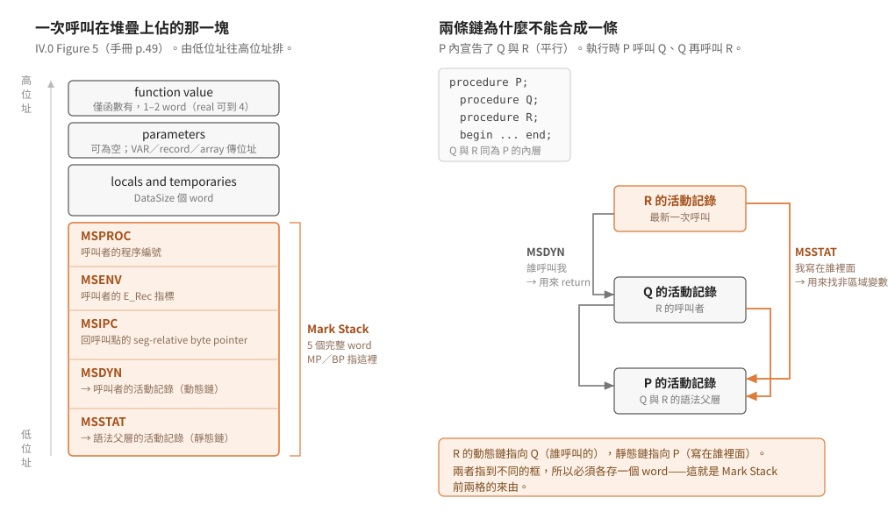

# 記憶體佈局、Task 環境與活動記錄

出自 SofTech Microsystems《UCSD p-SYSTEM and UCSD PASCAL Version IV.0
Internal Architecture Guide》（1981 年 3 月第一版）Chapter II「The P-Machine」，
印刷頁 40–53（PDF 頁 48–59）。印刷頁 52–53 已是逐條 opcode 描述的開頭，
本文只記到慣例說明為止。

結論先講：IV.0 的活動記錄是 **5 個 word 的 Mark Stack（MSSTAT/MSDYN/MSIPC/MSENV/MSPROC）
+ DataSize 個 word 的區域變數與暫存 + 參數 + 函數回傳值**，由低位址往高位址排；
每個並行 task（PROCESS）有自己的堆疊與 TIB，主記憶體從低到高是
直譯器、各 segment 的全域資料、各 PROCESS 堆疊、HEAP、CODE POOL、主 STACK、
常駐作業系統。參數格式只有五種（UB/SB/DB/B/W），其中 **B（Big）就是 repo 術語表
裡的「變長運算元」**。

> 延伸閱讀：[本層索引](README.md)｜[指令編碼](../20-pcode-encoding/instruction-encoding.md)（變長運算元的推導）

## Task 環境（手冊 §II.3，p.40–43）

- task 是與其他 routine 並行執行的 routine，由三個資料結構實作：body、
  Task Information Block（TIB）、task stack。在 Pascal 裡 task 就是 `PROCESS`
  （手冊 p.40）。
- 「main task」是從作業系統初始化到終結、貫穿所有系統工具與使用者程式執行的
  那條執行緒；程式可以有附屬（subsidiary）task（手冊 p.40）。
- 附屬 task 用自己的堆疊，不用 System Stack；task 的活動記錄就放在 task stack 裡，
  兩者都配置在 Heap 上，並留一段成長空間。task body 是 p-code segment 的一部分，
  結構與 procedure/function 的 body 無異（手冊 p.40）。
- task stack 大小由 `START` intrinsic 的 `STACKSIZE` 參數決定，**預設 200 words**
  （手冊 p.40）。
- main task 用 System Stack 做運算與活動記錄；Heap 由 main task 與所有附屬 task
  共用（手冊 p.40）。
- 附屬 task 的 TIB 在 task 啟動時配置於 Heap，保存執行環境，task 從 idle 重新啟動時
  要還原（手冊 p.40）。
- 任一時刻 p-machine 上有：一個執行中的 task、數個 ready 的 task、數個在等
  semaphore 的 task。ready 的排成一個佇列，每個 semaphore 各有一個（可能為空的）
  等待佇列；佇列內按優先權排序（手冊 p.40）。
- p-machine 暫存器 **`CURTSK`** 永遠指向目前執行中 task 的 TIB；**`READYQ`** 指向
  ready 佇列的頭（手冊 p.40）。

### TIB 結構（手冊 p.41–42）

手冊以 Pascal 片段描述 TIB，照抄如下：

```pascal
TIB = RECORD    {Task Information Block}
        Regs: PACKED RECORD
                Wait_Q: TIB_Ptr;
                Prior: byte;
                Flags: byte;
                SP_Low: Mem_Ptr;
                SP_Upr: Mem_Ptr;
                SP: Mem_Ptr;
                MP: MSCW_Ptr;
                BP: MSCW_Ptr;
                IPC: integer;
                Env: ERec_Ptr;
                ProcNum: byte;
                TIBIOResult: byte;
                Hang_Ptr: Sem_Ptr;
                M_Depend: integer;
              END {of Regs};
        MainTask: Boolean;
        Start_MSCW: MSCW_Ptr;
      END {of TIB}
```

各欄位意義（手冊 p.41–42）：

| 欄位 | 意義 |
|---|---|
| `SP` / `SP_Low` / `SP_Upr` | p-machine 堆疊指標，與此 task 的 SP 上下限 |
| `MP` / `BP` | 分別指向此 task 的 local 與 global 活動記錄（MSCW） |
| `IPC` | p-code 指令計數器，seg-relative byte pointer |
| `ProcNum` | 執行中 routine 的編號 |
| `Prior` | task 優先權，0..255，**數值越小越優先** |
| `Wait_Q` | task 在 ready 或等 semaphore 時，作為 TIB 鏈結串列的一環 |
| `Hang_Ptr` | 等 semaphore 時指向該 semaphore；否則為 NIL。task 被終止時靠它把自己從 semaphore 等待佇列移除 |
| `Flags` | 保留未來使用 |
| `Env` | 指向 task 的 E_Rec；task 的 SIB（Segment Information Block）可經由 E_Rec 找到 |
| `TIBIOResult` | 未來用來存 task 局部的 IORESULT |
| `M_Depend` | 直譯器維護的機器相關資料，初始化為 0 |
| `MainTask` | 為 TRUE 表示這是「root」（parent）task 的 TIB |
| `Start_MSCW` | 指向 `START` 啟動此 task 的那個 routine 的 MSCW（Mark Stack Control Word） |

task 的進一步資訊在 Chapter IV；Figure 4 畫出系統執行時的主記憶體佈局，
含 task stack 的位置（手冊 p.42）。

## 主記憶體佈局（Figure 4，手冊 p.43）

```
高位址 ┌─────────────────────────────┐
       │ OPERATING SYSTEM            │   (子集常駐)
       ├─────────────────────────────┤
       │ STACK                       │
       │  ▼(向下成長)                │
       ├─────────────────────────────┤
       │ CODE POOL                   │
       │  ▲(向上成長)                │
       ├─────────────────────────────┤
       │ HEAP                        │
       ├─────────────────────────────┤
       │ PROCESS1 STACK              │
       │  ▼(向下成長)                │
       ├─────────────────────────────┤
       │ PROCESS 2 STACK             │
       │  ▼(向下成長)                │
       ├─────────────────────────────┤
       │ GLOBAL DATA SEG1            │
       ├─────────────────────────────┤
       │ GLOBAL DATA SEG2            │
       ├─────────────────────────────┤
       │ INTERPRETER                 │
低位址 └─────────────────────────────┘
```

圖上方標註 `odd` / `even` 兩側，表示 word 的兩個位元組方向。STACK 向下、
CODE POOL 向上，兩者相向成長共享中間空間；各 PROCESS STACK 亦向下成長。
（重現自手冊 Figure 4，p.43。）

## intrinsic `P_MACHINE`（手冊 §II.4.1，p.44–45）

- Pascal 編譯單元可呼叫 intrinsic procedure `P_MACHINE` 直接產生 inline p-code，
  供極低階系統程式設計用。**系統不提供任何保護**，使用風險自負（手冊 p.44）。
- 形式：`P_MACHINE ( <P-machine item> {, <P-machine item>} )`，每個 item 產生
  一或多個 byte 的 p-code（手冊 p.44）。
- item 有三種（手冊 p.44）：
  1. **p-code syllable**：一個（非 real）純量常數，產生該常數最低位元組的一個 byte。
  2. **運算式值**：括號括住的運算式，產生計算它並把值留在堆疊上的 p-code。
  3. **位址參照**：第一個 token 是 `^`，後接變數，產生把該變數位址推上堆疊的
     p-code。
- item 不可以是字串常數（手冊 p.44）。

範例（手冊 p.45）：給定

```pascal
CONST STO = 196;
TYPE  Records = RECORD FirstField, SecondField: integer END;
      PRecords = ^Records;
VAR   Vector: ARRAY [0..9] OF PRecord;
      i: integer;
```

則 `PMACHINE ( ^Vector[5]^.FirstField, (i*i), STO)` 會把 `i` 的平方存入
`Vector` 第六個元素所指 record 的第一個欄位。（註：手冊範例中 `PRecord` 與宣告處
的 `PRecords`、以及呼叫處的 `PMACHINE` 與前文 `P_MACHINE` 寫法不完全一致，
照掃描原文轉錄，疑為手冊自身的排版差異——待查證。）

## 指令參數格式（手冊 §II.4.2.1.1，p.46）

p-code 指令的參數在編譯期產生，是靜態的，描述運算元的位置與大小。
**只有五種格式，沒有別的**：

| 格式 | 名稱 | 語意 |
|---|---|---|
| `UB` | Unsigned Byte | 0..255 的正整數；轉 16-bit 二補數時高位元組補 0 |
| `SB` | Signed Byte | −128..127 的 8-bit 二補數；轉 16-bit 時高位元組做符號擴展（全部等於低位元組的 bit 7） |
| `DB` | Don't care Byte | 0..127；bit 7 永遠是 0，可當 SB 或 UB 處理 |
| `B` | Big | 變長：第一個位元組 bit 7 = 0 時，剩下 7 個 bit 表示 0..127；bit 7 = 1 時清掉該位，第一個位元組是 16-bit word 的高位元組、下一個位元組是低位元組。可表示 0..32767 |
| `W` | Word | 兩個位元組，16-bit 二補數，−32768..32767，**永遠低位元組在前** |

`B` 格式就是 repo 術語表所稱的「變長運算元（big operand）」，編碼規則與
CONTEXT.md 所述一致（手冊 p.46）。

## 動態運算元型別（手冊 §II.4.2.1.2，p.47–48）

逐條 opcode 描述裡用到的堆疊運算元型別：

| 型別 | 意義 |
|---|---|
| Activation Record | 見下節 |
| `Addr` | 16-bit 硬體 word 位址（byte-addressable 機器上通常是偶數） |
| `Bool` | 當邏輯值用的 16-bit 量 |
| `Byte-ptr` | 32-bit:TOS 是 byte 陣列內的索引，TOS-1 是陣列基底的 word 位址。byte-ptr 用兩個 word，使 word-addressed 機器也能指定單一位元組 |
| `Int` | 16-bit 二補數整數 |
| `Nil` | 參照無效位址的常數，實際值因處理器而異 |
| `Offset` | code segment 內的偏移，是 word 或 byte 偏移視主機自然定址單位而定 |
| `Pack-ptr` | 三個 word，指定 16-bit word 內的位元欄位：TOS = 欄位最右 bit 編號，TOS-1 = 欄位位元數，TOS-2 = 該 word 的位址 |
| `Real` | 32-bit 或 64-bit 浮點數 |
| `Set` | 0..255 個 word 的位元旗標，前面一個 word 記 word 數 |
| `Word` | 16-bit 量，可任意解讀（整數、Boolean、位址等） |
| `Word-block` | 零或多個 word 的一組 |

## 活動記錄（Figure 5，手冊 §II.4.2.1.3，p.48–50）

每次呼叫一個 active routine 就建立一份活動記錄（手冊 p.48）。
Figure 5（手冊 p.49）的配置，由低位址往高位址：

<p align="center"></p>

`MSSTAT` 那端是 least significant byte 所在的一端（手冊 p.49）。

各部分（手冊 p.50）：

1. **Mark Stack**：五個（完整）word 的管理資訊——
   - `MSSTAT`：指向語法上父層（lexical parent）活動記錄的指標（靜態鏈）
   - `MSDYN`：指向呼叫者（caller）活動記錄的指標（動態鏈）
   - `MSIPC`：呼叫者內呼叫點的 seg-relative byte pointer（回傳位址）
   - `MSENV`：呼叫者的 E_Rec 指標
   - `MSPROC`：呼叫者的程序編號
2. **區域變數與暫存**：長度為 DataSize words。
3. **參數**：可為空。VAR 參數、record 與 array 的傳值參數放的是**位址**；
   其他傳值參數放**值**。
4. **函數回傳值**：僅函數有，一或兩個 word（若 real 是那麼大則四個 word）。

Mark Stack 就是 TIB 裡 `MSCW_Ptr` 所指的那塊，`MP`/`BP` 都以它為框基準
（對照手冊 p.41 與 p.49–50）。

## 逐條 opcode 描述的記法慣例（手冊 §II.4.2.1.4，p.50–51）

- §II.4.2.2 起按操作性質分組描述各條指令。左欄是助記符與其值
  (**所有 p-code 指令都是單一位元組**)，接著是參數格式（若有）；右欄是文字說明
  （手冊 p.50）。
- 同一指令若有多個同格式參數，用底線加數字區分，同類由左至右從 1 編號
  （手冊 p.50）。
- opcode 值下方用記法描述執行前後的堆疊，只畫運算求值部分（堆疊頂端幾個 word）。
  格式為 `<執行前>:<執行後>`；角括號內堆疊由左往右成長，運算元以逗號分隔，
  豎線 `|` 表示互斥的二選一；最靠右括號的是 TOS；空括號 `<>` 表示求值堆疊為空
  （手冊 p.50–51）。

## 印刷頁 52–53（超出本文範圍的起頭）

§II.4.2.2 逐條指令從這裡開始：`SLDC`（0..31）、`LDCN`（152）、`LDCB`（128 UB）、
`LDCI`（129 W）、`LCO`（130 B）、`SLDL1..16`（32..47）、`LDL`（135 B）、
`SLLA1..8`（96..103）、`LLA`（132 B）、`SSTL1..8`（104..111）、`STL`（164 B）、
`SLDO1..16`（48..63）、`LDO`（133 B）、`LAO`（134 B）、`SRO`（165 B）、
`SLOD1`（173 B）/`SLOD2`（174 B）、`LOD`（137 DB, B）。這些屬於 opcode 表的範圍，
此處僅記頁面交界，細節留給對應的 opcode 筆記。

## 與 IV.2.1 的關係

本手冊描述的是 IV.0；repo 研究的 SunDog 直譯器是 IV.2.1。已可對上的穩定點：

- **`B`（big operand）編碼**：IV.0 手冊（p.46）的規則與從 SunDog `SYSTEM.INTERP`
  反組譯出的運算元解碼器逐行吻合（見
  [sundog-ivx-table](../30-opcode-tables/sundog-ivx-table.md)的 `sub_668`），此慣例
  跨 IV.0 → IV.2.1 不變。
- **短形式範圍**：IV.0 手冊 p.52–53 所列 `SLDC` 0..31、`SLDL` 32..47、
  `SLDO` 48..63、`SLLA` 96..103、`SSTL` 104..111 與 IV.2.1 直譯器解出的分配
  一致，顯示這套短形式切法在 IV.0 就已定形。
- **Mark Stack 五欄**：SunDog 的 `sub_668` 對框位移加 8(= 4 word)再取值的
  寫法，與本手冊「區域變數在 5-word Mark Stack 之上」的結構相符的精確程度
  （4 vs 5 word 的帳）**待查證**——直譯器常式裡 `+8` 之後還經過一層靜態鏈間接，
  直接對讀前不宜下結論。
- 手冊未提 IV.0 與後續子版的差異；opcode 值(如 `LDCN`=152)是否沿用至 IV.2.1，
  需與 1983 年 IV 版 opcode 頁或 `laanwj/sundog` 的表逐條比對，此處不臆測。
